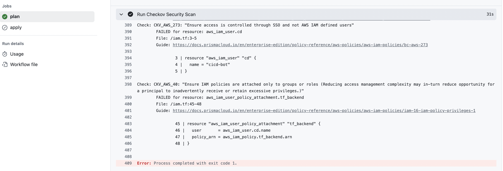
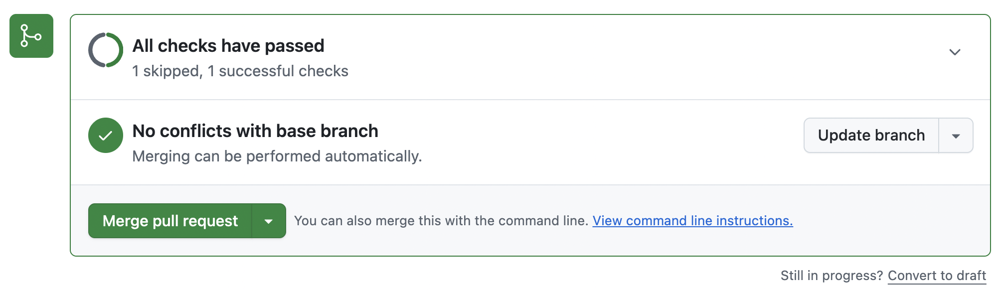
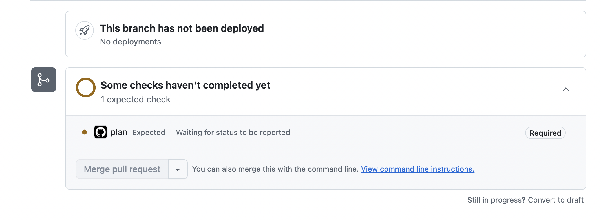

### Checkov configuration for terraform code scan

The simplest approach of Checkov configuration is to adding it as one another step. We can create separate action with the checkov and also call this action from the step of the job. Also we can create callable workflow.

With the workflow configuration as this:
```yaml
name: Terraform AWS Deploy

on:
  pull_request:
    branches: [ "main" ]
    paths: [ "infra/**" ]
  push:
    branches: [ "main" ]
    paths: [ "infra/**" ]

permissions:
  contents: read
  id-token: write
  pull-requests: write  # For commenting on PRs

jobs:
  plan:
    runs-on: ubuntu-latest
    environment: PROD
    if: github.event_name == 'pull_request'
    
    steps:
      # Checkout repository
      - name: Checkout repo
        uses: actions/checkout@v4

      # Configure AWS credentials
      - name: Configure AWS
        uses: aws-actions/configure-aws-credentials@v4
        with:
          aws-access-key-id: ${{ secrets.AWS_ACCESS_KEY_ID }}
          aws-secret-access-key: ${{ secrets.AWS_SECRET_ACCESS_KEY }}
          aws-region: ${{ vars.AWS_REGION }}

      # Cache Terraform plugin directory (faster CI)
      - name: Cache TF plugins
        uses: actions/cache@v4
        with:
          path: ~/.terraform.d/plugin-cache
          key: terraform-${{ runner.os }}-${{ hashFiles('infra/**/*.tf') }}

      # Install Terraform
      - name: Setup Terraform
        uses: hashicorp/setup-terraform@v3
        with:
          terraform_version: 1.9.6


      # Init
      - name: Terraform Init
        run: terraform init -input=false
        working-directory: ./infra

      # Security Scan with Checkov
      - name: Run Checkov Security Scan
        run: |
          pip install checkov
          checkov -d ./infra --framework terraform --output cli
        continue-on-error: false

      # Plan
      - name: Terraform Plan
        run: terraform plan -input=false -out=tfplan
        working-directory: ./infra

  apply:
    runs-on: ubuntu-latest
    environment: PROD
    if: github.ref == 'refs/heads/main' && github.event_name == 'push'
    
    steps:
      # Checkout repository
      - name: Checkout repo
        uses: actions/checkout@v4

      # Configure AWS credentials
      - name: Configure AWS
        uses: aws-actions/configure-aws-credentials@v4
        with:
          aws-access-key-id: ${{ secrets.AWS_ACCESS_KEY_ID }}
          aws-secret-access-key: ${{ secrets.AWS_SECRET_ACCESS_KEY }}
          aws-region: ${{ vars.AWS_REGION }}

      # Install Terraform
      - name: Setup Terraform
        uses: hashicorp/setup-terraform@v3
        with:
          terraform_version: 1.9.6

      # Init
      - name: Terraform Init
        run: terraform init -input=false
        working-directory: ./infra

      # Plan and Apply
      - name: Terraform Plan
        run: terraform plan -input=false
        working-directory: ./infra

      # Apply
      - name: Terraform Apply
        run: terraform apply -input=false -auto-approve
        working-directory: ./infra
```

We actually just highlight the problem with the terraform code:


and it does not prevent us from merging it to the main and deploy code. See at screenshot below the "Merge pull request" button is active


Different companies handle it differently. But for strict gate in CI we need just perform a few configuration option.
Go to Settings / Branches and for main branch rule configure:
 - Require status checks to pass before merging
 - Require branches to be up to date before merging
 select status checks that are required = "plan"

as shown below


and ensure that 

....

Do not allow bypassing the above settings
The above settings will apply to administrators and custom roles with the "bypass branch protections" permission.

is "enabled". 
Now we are not enabled to merge PR:


After changing continue-on-error to "true" value.

      - name: Run Checkov Security Scan
        run: |
          pip install checkov
          checkov -d ./infra --framework terraform --output cli
        continue-on-error: true

it will allow to merge PR. The plan execution is shown as successfull dispite that checkov exited with exit code 1 after finding security issues:




to sum it up:
   - continue-on-error set to true allows to avoid any repo security settings, Require status checks to pass before merging 
   - without configure "Require status checks to pass before merging" we can merge PR even when continue-on-error = false
   - if we want to crate strict gate (security / quality / etc) the both continue-on-error for the step and "Require status checks to pass before merging" need to be configured

## Behavior Matrix

The following table shows the interaction between `continue-on-error` setting and branch protection rules:

| `continue-on-error` | Branch Protection Enabled | Workflow Status | Can Merge PR? | Notes |
|-------------------|--------------------------|----------------|---------------|--------|
| `false` | ❌ No | ❌ Failed | ✅ **Yes** | Workflow fails but merge is allowed |
| `true` | ✅ Yes | ✅ Success | ✅ **Yes** | Step failure is ignored, workflow succeeds |
| `false` | ✅ Yes | ❌ Failed | ❌ **No** | ✅ **Strict gate - Recommended** |
| `true` | ❌ No | ✅ Success | ✅ **Yes** | Step failure is ignored |

### Key Takeaways:

- 🚨 **`continue-on-error: true`** always allows merging (workflow shows success even if Checkov finds issues)
- ⚠️ **No branch protection** always allows merging (regardless of workflow status)
- ✅ **For strict security enforcement**: Use `continue-on-error: false` + "Require status checks to pass before merging"
- 🛡️ **Best practice**: Both settings must be configured together to create an effective security gate


### Github Rulesets

Github Rulesets is modern approach which plays the similiar role as branch protection rules, but it allows to configure rules in more avanced / .. way as well as share these rules. Play with the rulesets configuration separatelly.


### Possible visconfiguration
Be carefull with configuration. If your job is triggered by the block of the configuration:
```yaml
on:
  pull_request:
    branches: [ "main" ]
    paths: [ "infra/**" ]
  push:
    branches: [ "main" ]
    paths: [ "infra/**" ]
```
your will be not able to make changes to the workflow ocnfiguration (terraform.yaml)




because actions starts running only after changing to the infra, and we add plan job is mandatory in github settings which will not run. To avoid this some bump version similiar changes to TF can be made.


This is why the checkov check has to be moved to separate action.