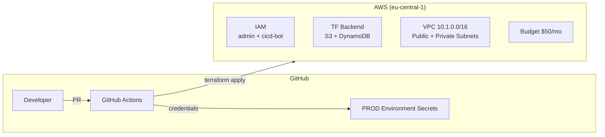
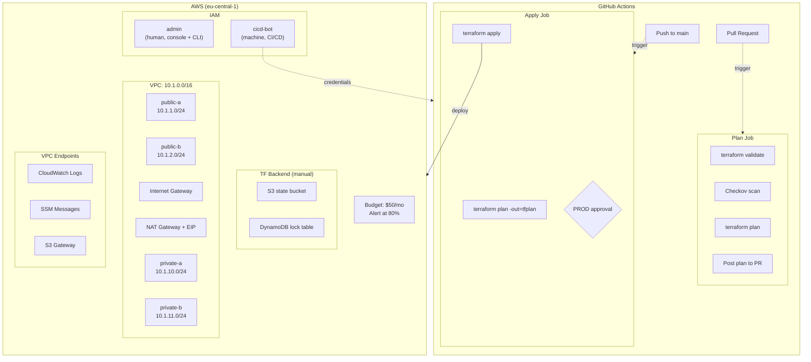
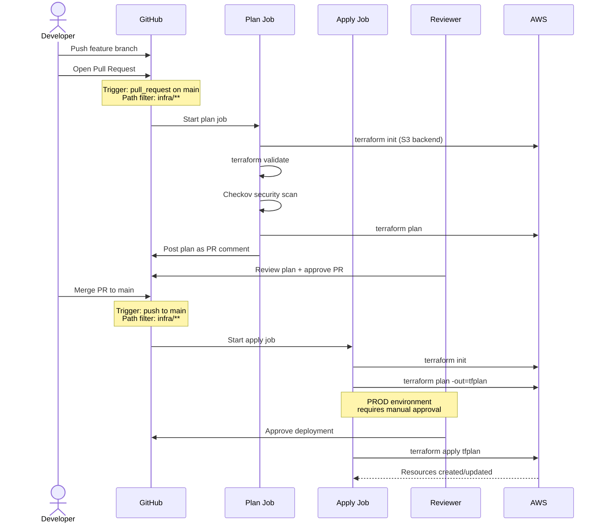
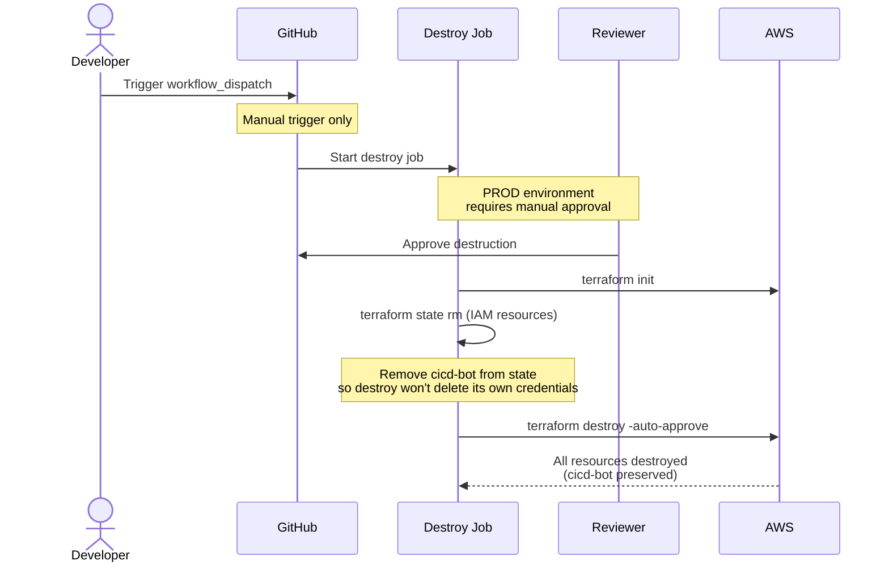
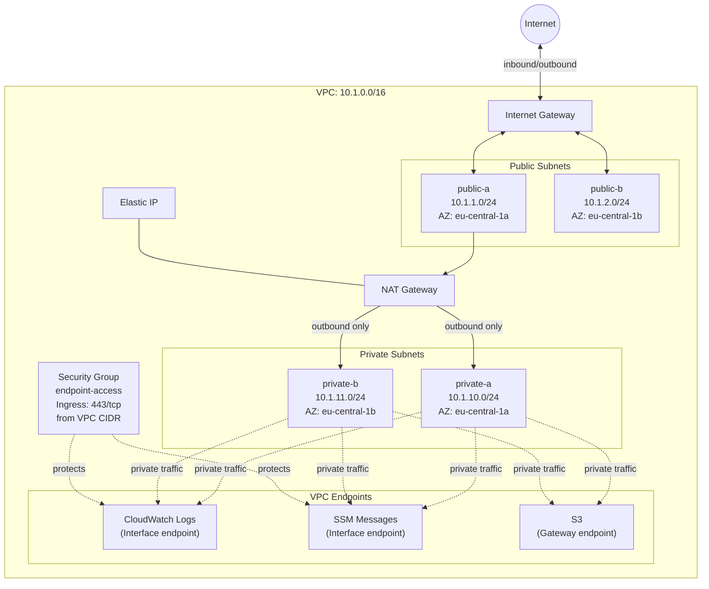

## Architecture overview

### High-level infrastructure diagram



### CI/CD and AWS components



### CI/CD deploy workflow



### Destroy workflow



### Network architecture



### Repository structure

```
aws-env-setup/
├── .github/
│   └── workflows/
│       ├── terraform-deploy.yml    # Plan on PR, apply on merge
│       └── terraform-destroy.yml   # Manual teardown
├── infra/                          # Terraform root module
│   ├── main.tf                     # Provider, backend, locals
│   ├── variables.tf                # Input variables
│   ├── outputs.tf                  # cicd-bot access keys
│   ├── iam.tf                      # cicd-bot user + policies
│   ├── network.tf                  # VPC, subnets, NAT, endpoints
│   └── budgets.tf                  # AWS budget alarm
├── docs/                           # Lab documentation
└── .gitignore                      # Terraform state exclusions
```

### What is managed manually vs. by Terraform

| Resource | Managed by | Why |
|---|---|---|
| AWS account, root user | Manual | One-time setup |
| `admin` IAM user + Administrators group | Manual | Needed before Terraform can run |
| S3 bucket (state) | Manual | Terraform can't manage its own backend. S3 bucket names are globally unique — choose your own name |
| DynamoDB table (lock) | Manual | Same reason |
| VPC, subnets, NAT, endpoints | Terraform | Core infrastructure |
| `cicd-bot` IAM user + policies | Terraform (`prevent_destroy`) | CI/CD credentials — removed from state before destroy to avoid deleting its own credentials |
| Budget alarm ($50/month) | Terraform | Automated cost control |
| GitHub environment + secrets | Manual | GitHub-side config, not AWS |

### Retrieving cicd-bot credentials

The `cicd-bot` IAM user and access key are managed by Terraform with `prevent_destroy` lifecycle. After the initial `terraform apply` (run with admin credentials), retrieve the cicd-bot credentials before configuring AWS CLI:

```bash
# 1. Get the cicd-bot credentials from Terraform output
terraform output cd_user_access_key_id
terraform output -raw cd_user_access_key_secret

# 2. Configure AWS CLI with the cicd-bot credentials
aws configure
```

Then add the same credentials to your GitHub repository secrets (Settings > Environments > PROD):
- `AWS_ACCESS_KEY_ID` — access key ID
- `AWS_SECRET_ACCESS_KEY` — secret access key
- `AWS_REGION` (variable) — `eu-central-1`

### Safety mechanisms

| Mechanism | What it does |
|---|---|
| Path filtering (`infra/**`) | Only infra changes trigger the pipeline |
| Concurrency control | Queues runs, never cancels in-progress applies |
| `-out=tfplan` | Apply uses the exact saved plan, no re-evaluation |
| DynamoDB state locking | Prevents concurrent state modifications |
| PROD environment approval | Requires manual approval before apply |
| Checkov security scan | Catches misconfigurations in Terraform code |
| Branch protection | All changes go through PRs, no direct push to `main` |

### Network design

The VPC follows a standard two-tier architecture across two availability zones:

**Public subnets** (`10.1.1.0/24`, `10.1.2.0/24`):
- Route to the internet via Internet Gateway
- Host public-facing resources (ALB, NAT Gateway)
- Auto-assign public IPs

**Private subnets** (`10.1.10.0/24`, `10.1.11.0/24`):
- Route outbound traffic through a single NAT Gateway in `public-a`
- Host internal resources (ECS tasks, databases)
- No public IP assignment

**VPC Endpoints** reduce NAT costs and improve latency for AWS services:
- **CloudWatch Logs** (Interface) — container/application logging
- **SSM Messages** (Interface) — ECS Exec and remote access
- **S3** (Gateway) — free, no NAT charges for S3 access

> **Cost note:** The NAT Gateway is the most expensive component in this setup (~$32/month + data transfer). VPC endpoints help offset this by routing AWS service traffic directly, bypassing the NAT.

### Tagging strategy

All resources are tagged via the provider's `default_tags`:

| Tag | Value | Purpose |
|---|---|---|
| `Environment` | `default` (workspace name) | Identify environment |
| `Project` | `ci-cd-security-course` | Group resources by project |
| `Contact` | `kostia.shiian@gmail.com` | Owner for billing/questions |
| `ManageBy` | `Terraform/setup` | Distinguish IaC-managed resources |
