## Lab environment preparation

### Objectives of this lab

The objectives of this lab are to have a fully configured AWS environment for infrastructure management:

- Learn how to create a free-tier AWS account
- Become familiar with one of the popular cloud providers
- Be able to create a VPC (public and private subnets)
- Configure networking components (NAT gateway, internet gateway, route tables)
- Create a basic account configuration that can be easily set up using Terraform and torn down to minimize costs
- Make the Terraform setup production-ready (encrypted S3 bucket for Terraform state, DynamoDB for state locking, etc.)

We are going to create only the base part of the setup manually. All other AWS resources will be managed by Terraform.

### Create AWS free-tier account

Go to the [AWS Management Console](https://aws.amazon.com/console/) and click "Create Account".

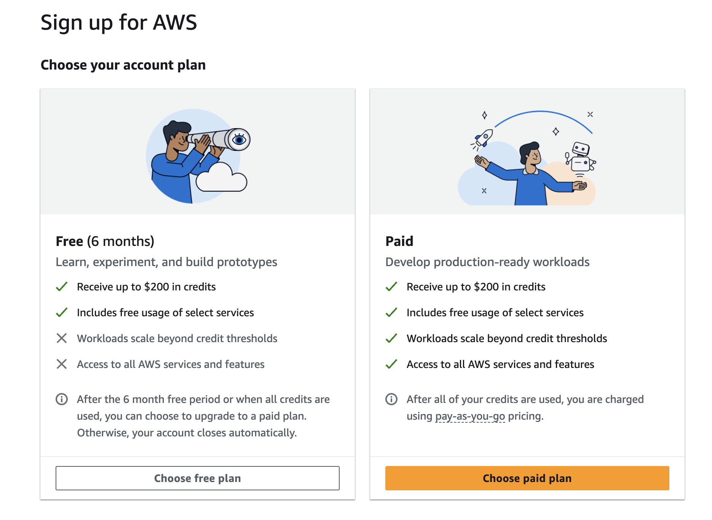

Prerequisites:
- Email (use popular email providers like gmail.com or outlook.com)
- Bank card (use a virtual card with a low spending limit)
- Phone number (for mobile verification)

At the time of my registration, I was provided with 100 USD in credits and additional bonuses for completing activities:

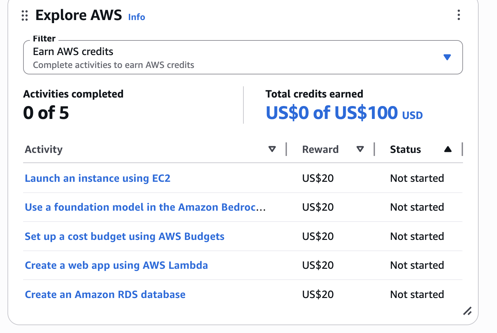

### Region

Use the `eu-central-1` region.

### Enable access to billing

By default, only the root account can see billing and cost data. Regular IAM users — even those with `AdministratorAccess` — cannot view billing pages unless the root account explicitly enables it. Without this, your IAM users won't be able to see costs, set up budgets, or monitor spending.

To enable it:

1. Sign in as the **root user** (this setting can only be changed by the root account)
2. Navigate to **Billing Console → Account** (or use the link below)
3. Scroll down to **"IAM User and Role Access to Billing Information"**
4. Click **Edit**, check **"Activate IAM Access"**, and click **Update**

https://us-east-1.console.aws.amazon.com/billing/home?region=eu-central-1#/account

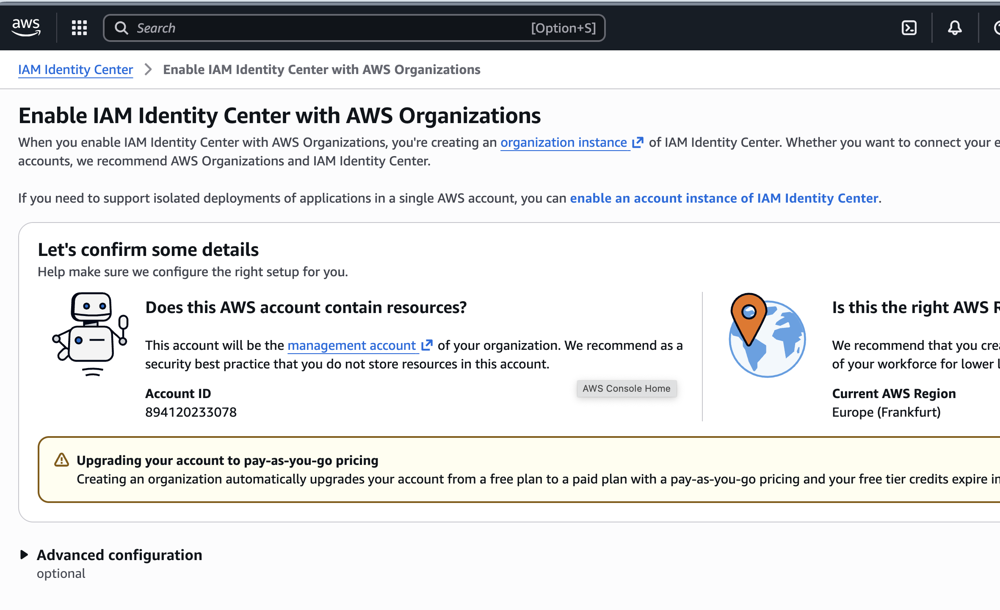

### Create a regular user

The root user has unrestricted access to everything in your AWS account. AWS best practice is to use it only for tasks that require it (like enabling billing access above) and create a regular IAM user for day-to-day work. This way you can rotate credentials and revoke access if needed, while keeping the root account locked away.

> **Note:** AWS also offers **IAM Identity Center** — a modern solution with SSO and external identity provider support. However, it may require creating an AWS Organization, which complicates a free-tier setup. We use classic IAM in this lab to keep things simple.

Go to IAM in AWS and create a new user.

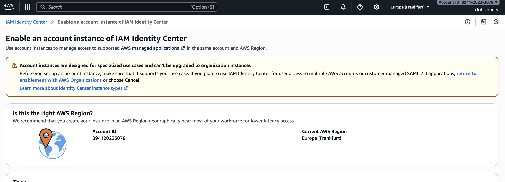

On the last screen you get the Console Sign-In details:
https://894120233078.signin.aws.amazon.com/console

Add this URL to your browser bookmarks.

### Create an Administrators group

Now go to groups and create an Administrators group:
https://us-east-1.console.aws.amazon.com/iam/home?region=eu-central-1#/groups/create

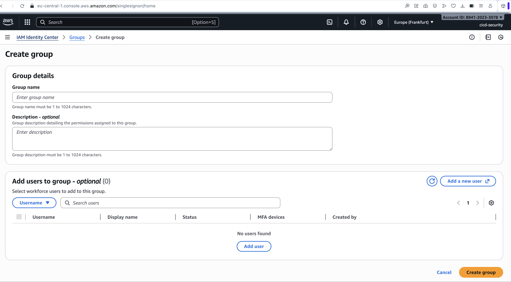

Select AdministratorAccess as the attached policy:


```json
{
    "Version": "2012-10-17",
    "Statement": [
        {
            "Effect": "Allow",
            "Action": "*",
            "Resource": "*"
        }
    ]
}
```

Add the created user to the group:

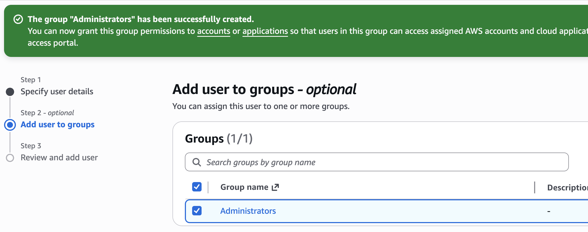

We use the AWS UI so that you can feel more comfortable working with the interface and become more familiar with it. The same can be done with the AWS CLI:

<details>
<summary>CLI alternative (click to expand)</summary>

```bash
# Create group and attach policy
aws iam create-group --group-name Administrators
aws iam attach-group-policy \
  --group-name Administrators \
  --policy-arn arn:aws:iam::aws:policy/AdministratorAccess

# Create user with console access
aws iam create-user --user-name john
aws iam create-login-profile \
  --user-name john \
  --password "StrongPassword123!" \
  --password-reset-required

# Add user to group
aws iam add-user-to-group \
  --user-name john \
  --group-name Administrators

# Create access key for programmatic use
aws iam create-access-key --user-name john
```

</details>

### Create an Access Key

The last step for user configuration is to create an Access Key. This key will be used for programmatic access (CLI, Terraform, CI/CD).

Go to the user's Security Credentials tab and click "Create access key":
https://us-east-1.console.aws.amazon.com/iam/home?region=eu-central-1#/users/details/admin/create-access-key

<details>
<summary>Alternatives to access keys (click to expand)</summary>

There are other recommended approaches for authentication:
- **AWS CLI V2 with `aws login`** — use your existing console credentials in the CLI. [Documentation](https://docs.aws.amazon.com/cli/latest/userguide/cli-authentication-user.html)
- **AWS CloudShell** — a browser-based CLI to run commands. [Learn more](https://docs.aws.amazon.com/singlesignon/latest/userguide/identity-center-prerequisites.html?icmpid=docs_sso_console)
- **User federation** via external identity providers (Keycloak, AD FS, etc.) — common in companies. [Documentation](https://docs.aws.amazon.com/cli/latest/userguide/cli-authentication-user.html)

We use access keys in this lab for simplicity.

</details>

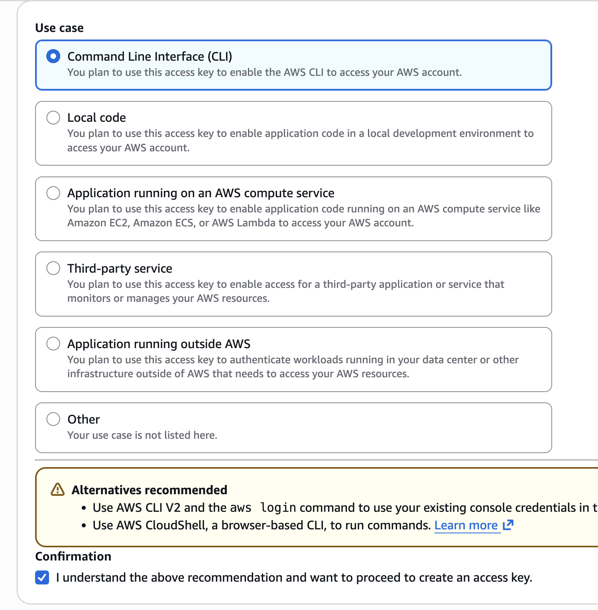

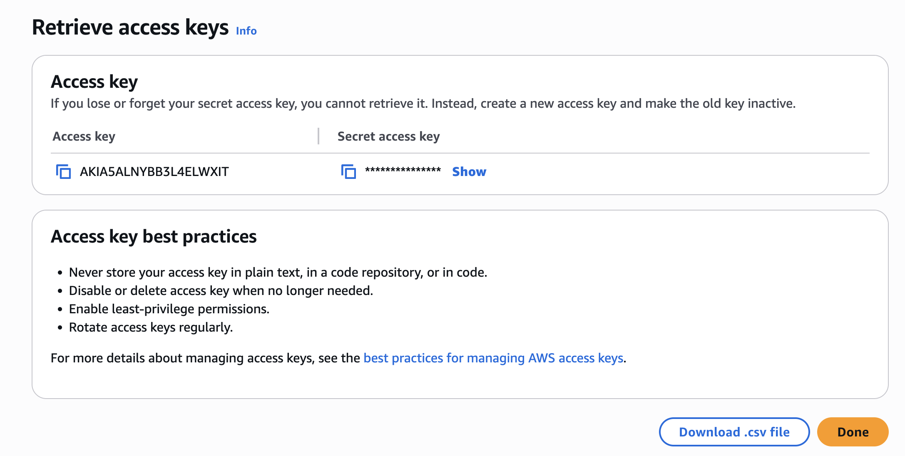

### Create a CI/CD user

It is a good practice to separate human and machine credentials. Create a dedicated IAM user for Terraform and CI/CD named `ci-bot`:

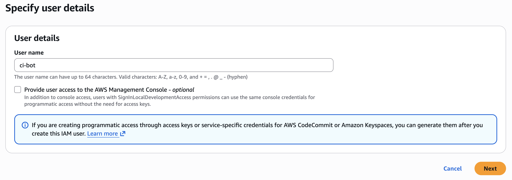

Add it to the Administrators group:

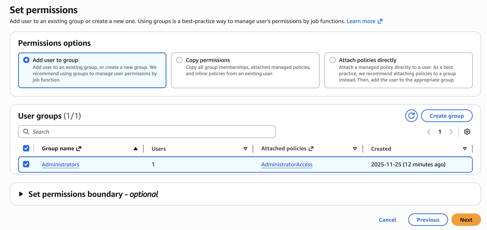

### Create a budget in AWS

The last step is to set up a billing budget to avoid unexpected charges. You can follow [this guide](https://www.udemy.com/course/devops-deployment-automation-terraform-aws-docker/learn/lecture/43769728#notes) or configure it directly in the AWS Billing console under Budgets.


### Configure S3 bucket and DynamoDB

Terraform needs a place to store its **state file** — a record of all resources it manages. By default, Terraform stores state locally, but this does not work for team collaboration or CI/CD pipelines. We use a remote backend with:

- **S3 bucket** — stores the Terraform state file (encrypted at rest)
- **DynamoDB table** — provides state locking to prevent concurrent modifications

We create these resources manually (not via Terraform) because Terraform cannot manage its own backend — it needs the bucket and table to already exist before it can initialize.

#### Create the S3 bucket

1. Go to the [S3 Console](https://s3.console.aws.amazon.com/s3/home?region=eu-central-1)
2. Click **Create bucket**
3. Bucket name: `cicd-security-tf-state-1` (must be globally unique — adjust if taken)
4. Region: `eu-central-1`
5. Enable **Bucket Versioning** (allows recovering previous state versions)
6. Enable **Server-side encryption** (SSE-S3)
7. **Block all public access** — leave this enabled (default)
8. Click **Create bucket**

Or via the AWS CLI:

```bash
aws s3api create-bucket \
  --bucket cicd-security-tf-state-1 \
  --region eu-central-1 \
  --create-bucket-configuration LocationConstraint=eu-central-1

aws s3api put-bucket-versioning \
  --bucket cicd-security-tf-state-1 \
  --versioning-configuration Status=Enabled

aws s3api put-bucket-encryption \
  --bucket cicd-security-tf-state-1 \
  --server-side-encryption-configuration '{
    "Rules": [{"ApplyServerSideEncryptionByDefault": {"SSEAlgorithm": "AES256"}}]
  }'
```

#### Create the DynamoDB table

1. Go to the [DynamoDB Console](https://eu-central-1.console.aws.amazon.com/dynamodbv2/home?region=eu-central-1#tables)
2. Click **Create table**
3. Table name: `cicd-security-tf-state-lock`
4. Partition key: `LockID` (type: String)
5. Leave all other settings as default
6. Click **Create table**

Or via the AWS CLI:

```bash
aws dynamodb create-table \
  --table-name cicd-security-tf-state-lock \
  --attribute-definitions AttributeName=LockID,AttributeType=S \
  --key-schema AttributeName=LockID,KeyType=HASH \
  --billing-mode PAY_PER_REQUEST \
  --region eu-central-1
```

### Bootstrap: first Terraform run (local)

The first `terraform init` and `terraform apply` must be run from your laptop. This is because the CI/CD pipeline itself depends on infrastructure that hasn't been created yet (the `ci-bot` access keys need to be stored as GitHub secrets, and those keys are a Terraform output). After the initial local run, all subsequent changes go through the GitHub Actions pipeline.

#### Install prerequisites

1. **Terraform** — install from [terraform.io](https://developer.hashicorp.com/terraform/install) or via a package manager:

We use version **1.14.5** (same as in CI/CD pipeline). Install it using one of the methods below:

```bash
# macOS
brew install terraform@1.14.5

# Ubuntu/Debian
wget https://releases.hashicorp.com/terraform/1.14.5/terraform_1.14.5_linux_amd64.zip
unzip terraform_1.14.5_linux_amd64.zip
sudo mv terraform /usr/local/bin/
```

```powershell
# Windows (using Chocolatey)
choco install terraform --version=1.14.5
```

Verify the installation:

```bash
terraform --version
# Expected: Terraform v1.14.5
```

2. **AWS CLI** — install version 2 from [aws.amazon.com/cli](https://aws.amazon.com/cli/):

```bash
# macOS
brew install awscli

# Ubuntu/Debian
curl "https://awscli.amazonaws.com/awscli-exe-linux-x86_64.zip" -o "awscliv2.zip"
unzip awscliv2.zip
sudo ./aws/install
```

```powershell
# Windows — download and run the MSI installer:
# https://awscli.amazonaws.com/AWSCLIV2.msi
```

Verify the installation:

```bash
aws --version
# Expected: aws-cli/2.x.x ...
```

#### Configure AWS credentials

Run `aws configure` and enter your admin user's access key (created in the "Create an Access Key" step above):

```bash
aws configure
```

You will be prompted for four values:

```
AWS Access Key ID [None]: AKIA...
AWS Secret Access Key [None]: wJal...
Default region name [None]: eu-central-1
Default output format [None]: json
```

This creates two files in your home directory:

```
~/.aws/
 ├── config        # region and output format
 └── credentials   # access key ID and secret key
```

```ini
# ~/.aws/config
[default]
region = eu-central-1

# ~/.aws/credentials
[default]
aws_access_key_id = AKIA...
aws_secret_access_key = wJal...
```

> **Security note:** Never commit these files to git. The `credentials` file contains secrets and should stay on your machine only. File permissions should be `600` (read/write for owner only) — `aws configure` sets this automatically.

Verify that your credentials work:

```bash
aws sts get-caller-identity
```

You should see your account ID, user ARN, and user ID:

```json
{
    "UserId": "AIDA...",
    "Account": "123456789012",
    "Arn": "arn:aws:iam::123456789012:user/admin"
}
```

#### Initialize and apply Terraform

```bash
cd infra

# Initialize the backend (connects to S3 + DynamoDB)
terraform init

# Preview the changes
terraform plan

# Apply the infrastructure
terraform apply
```

After a successful apply, Terraform will output the `ci-bot` access key ID. The secret key is marked as sensitive, so to reveal it run:

```bash
terraform output -raw cd_user_access_key_secret
```

Store both values as GitHub repository secrets (`AWS_ACCESS_KEY_ID` and `AWS_SECRET_ACCESS_KEY`) so the CI/CD pipeline can take over from here.

### GitHub repository configuration

#### Branching strategy

We use **GitHub Flow** — a simple trunk-based strategy where `main` is always the source of truth:

1. Create a short-lived feature branch from `main`
2. Make changes and open a PR
3. CI runs `terraform plan` automatically
4. Review the plan and merge to `main`
5. CI runs `terraform apply` on merge

```
main
 ├── feature/vpc-hardening
 ├── feature/security-groups-refactor
 └── fix/ecs-task-role
```

All infrastructure lives in a single **monorepo**. Each environment or component gets its own directory with an independent Terraform state, but they share modules and go through the same PR review process:

```
infrastructure/
 ├── modules/          # reusable Terraform modules
 │   ├── vpc/
 │   └── ecs/
 ├── prod/             # production root module
 │   ├── main.tf
 │   └── backend.tf
 └── dev/              # development root module (add later)
     ├── main.tf
     └── backend.tf
```

This approach keeps things simple — no long-lived environment branches that drift apart, no complex promotion pipelines. Adding a new environment is just adding a new directory, not a new branch.

#### Create a PROD environment in GitHub

Go to your repository **Settings → Environments** and create a new environment named `PROD`:


Set the following **Environment Secrets** (use the values from the Terraform bootstrap step):
- `AWS_ACCESS_KEY_ID` — copy from `terraform output -raw cd_user_access_key_id`
- `AWS_SECRET_ACCESS_KEY` — copy from `terraform output -raw cd_user_access_key_secret`

Set the following **Environment Variable**:
- `AWS_REGION` — set to `eu-central-1`

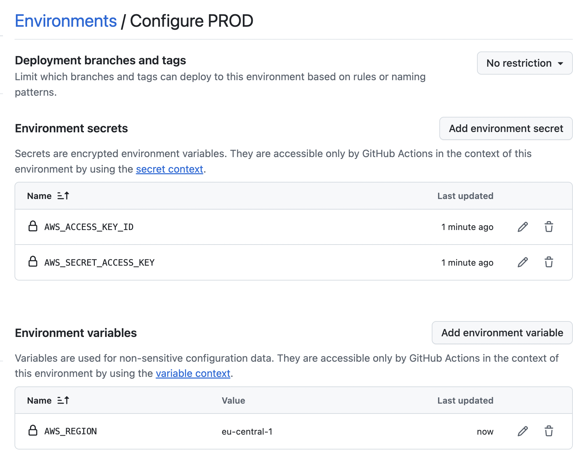

#### GitHub Actions workflow

Our CI/CD pipeline has two separate jobs:

- **plan** — runs on PR creation, shows what Terraform will change
- **apply** — runs on merge to `main`, deploys to production

A simpler approach is to run plan and apply in a single job:

```yaml
      # Plan
      - name: Terraform Plan
        run: terraform plan -input=false -out=tfplan
        working-directory: ./infra

      # Apply (proceed only on main)
      - name: Terraform Apply
        if: github.ref == 'refs/heads/main'
        run: terraform apply -input=false -auto-approve tfplan
        working-directory: ./infra
```

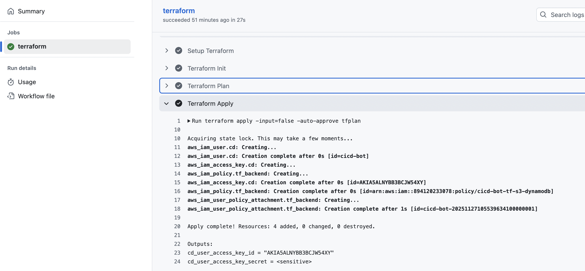

However, this skips the review step — incorrect changes can be applied without anyone checking the plan first. More sophisticated approaches require manual review before applying. Tools like [Atlantis](https://www.runatlantis.io/) can also help manage this for PRs.

We use **GitHub environment protection rules** to require manual approval before the apply job runs.

#### Configure environment protection rules

> **Note:** Your repository must have **Public** access for environment protection rules to work on free GitHub plans.

Go to **Settings → Environments → PROD** and enable deployment protection rules:

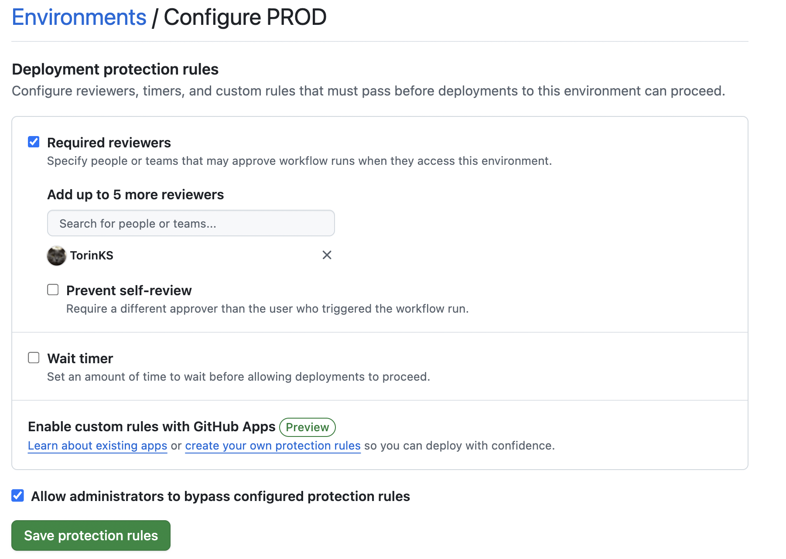

Now when the pipeline runs, you will see that approval is required before the apply job:

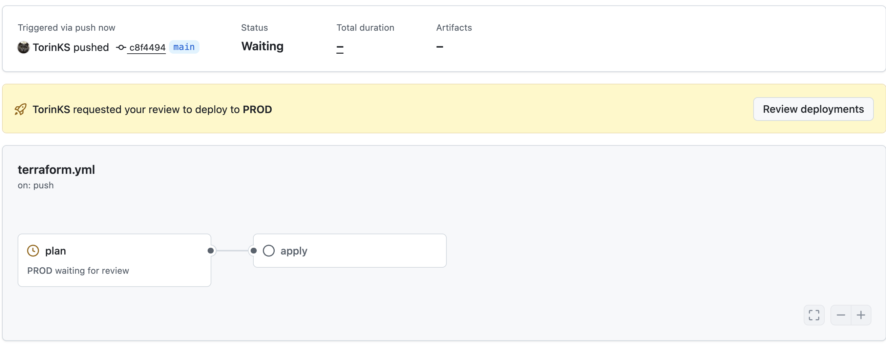

Review the plan output first:

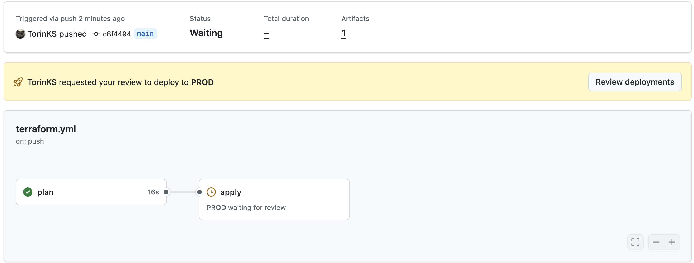

Then approve the apply job:

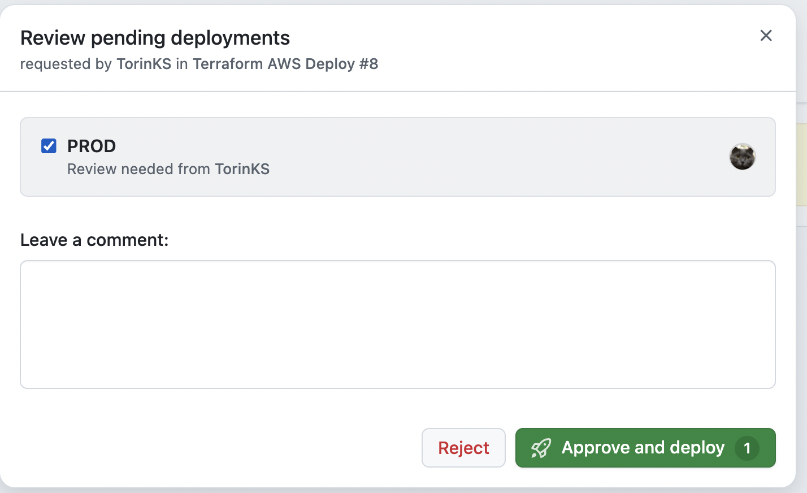

For more details, see the [GitHub documentation on environment protection rules](https://docs.github.com/en/actions/how-tos/deploy/configure-and-manage-deployments/configure-custom-protection-rules).

#### Protect the main branch

Disable direct pushes to `main` so that all changes go through pull requests with CI checks.

Go to **Settings → Branches** and add a branch protection rule for `main`:


This ensures that security scans and `terraform plan` must pass before changes can be merged.

