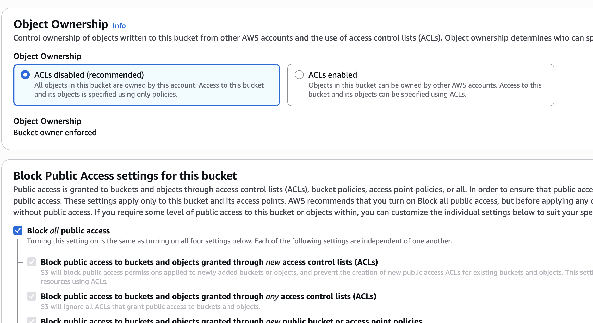
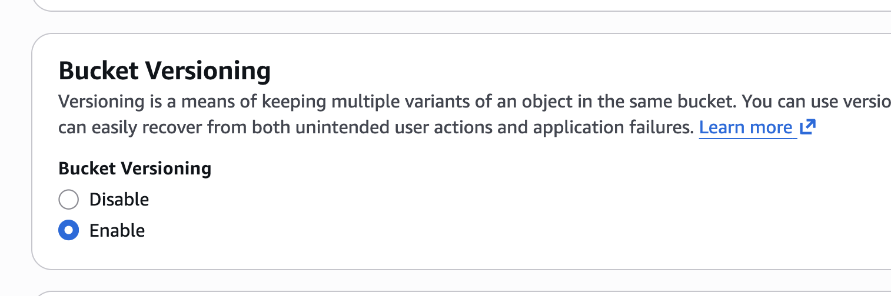
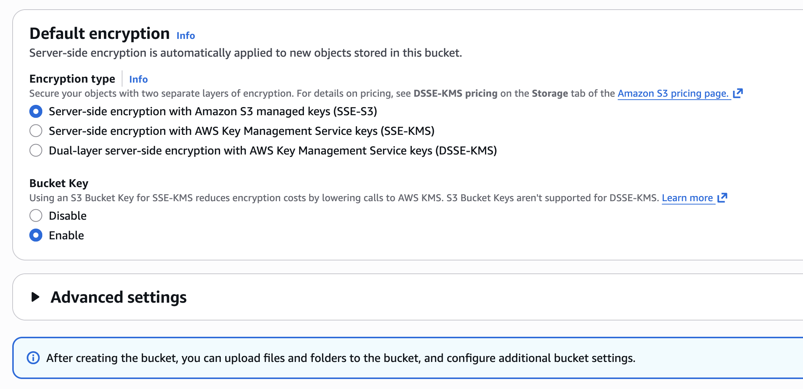
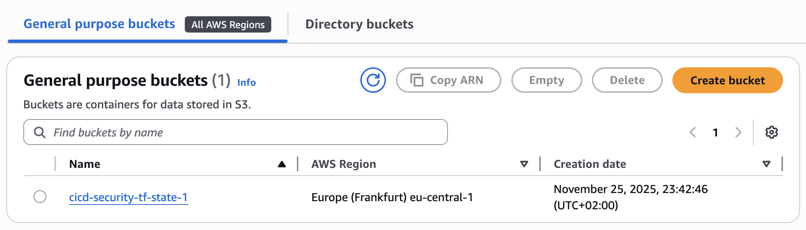
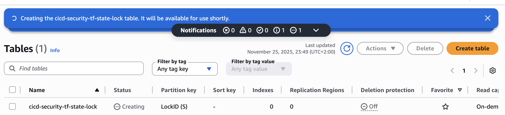

# Terraform Backend Setup

Infrastructure as Code best practice is to keep as much configuration in code as possible. However, some resources must be created manually before Terraform can manage the rest — specifically the **backend resources** that store Terraform state.

## Prerequisites

- AWS account with permissions to create S3 buckets and DynamoDB tables
- A CI bot user (e.g. `ci-bot`) for use in CI/CD pipelines

## 1. Create an S3 Bucket for Terraform State

The S3 bucket stores the Terraform state file, allowing anyone who runs Terraform to work against the same state.

1. Open the [S3 console](https://eu-central-1.console.aws.amazon.com/s3/get-started?region=eu-central-1)
2. Click **Create bucket**
3. Enter a bucket name (e.g. `cicd-security-tf-state-1`)
   > Bucket names must be globally unique across all of S3.

4. Configure the bucket settings:

   

5. **Enable Bucket Versioning** — this allows you to revert to a previous version of the Terraform state if needed:

   

6. Leave all remaining settings at their defaults:

   

7. Click **Create bucket**:

   

## 2. Create a DynamoDB Table for State Locking

DynamoDB provides state locking so that only one person or process can modify the infrastructure at a time. Without locking, concurrent Terraform runs could create conflicts and corrupt the state.

1. Open the DynamoDB console
2. Click **Create table**
3. Set the table name (e.g. `cicd-security-tf-state-lock`)
4. Set the **Partition key** to `LockID` (type: String)
5. Leave all other settings at their defaults
6. Click **Create table**

   

## Terraform Project Structure

The goal is to maximize infrastructure as code — create as little as possible manually.
